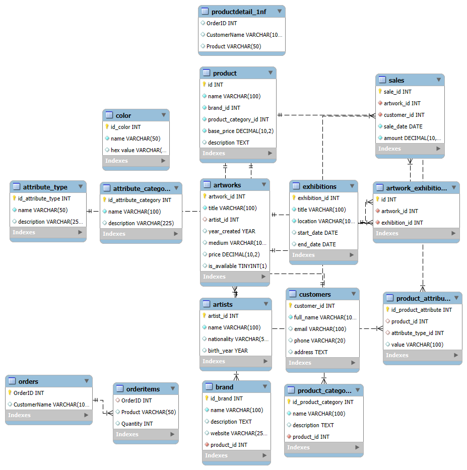

# Art Gallery Management System

## Project Description

This project is a **relational database system** built using **MySQL** for managing the core data of an Art Gallery. It includes tables for managing artists, artworks, exhibitions, visitors, ticketing, and artwork sales. The system is designed to ensure data integrity, reduce redundancy, and represent real-world relationships between gallery entities using proper SQL constraints and normalization principles.

---

## Objectives

- Design and implement a complete relational database using MySQL.
- Apply best practices in normalization (1NF, 2NF, 3NF).
- Use `CREATE TABLE` statements with appropriate data types and constraints.
- Establish 1-to-1, 1-to-many, and many-to-many relationships.
- Provide a clear ERD that visualizes the structure and relationships.

---

## Tools & Technologies

- MySQL Workbench 8.0 CE
- SQL (Structured Query Language)
- GitHub
- EER Diagram (Generated with MySQL Workbench)

---

## How to Set Up / Run the Project

1. Clone or download this repository.
2. Open MySQL Workbench.
3. Create a new schema (e.g., `art_gallery`).
4. Open the `art_gallery.sql` file provided.
5. Execute the entire script to create all tables.
6. (Optional) Open **File > New Model > Reverse Engineer** in Workbench to generate the EER Diagram.

---

## Database Structure (Main Tables)

- **Artists** – Stores details about artists.
- **Artworks** – Stores each artwork’s details and links to its artist.
- **Exhibitions** – Information about scheduled exhibitions.
- **Visitors** – People who attend exhibitions or buy tickets.
- **Tickets** – Visitor tickets for exhibitions.
- **Sales** – Tracks sales of artworks.
- **Artwork_Exhibition** – Junction table for many-to-many link between artworks and exhibitions.

---

## ERD Screenshot

> The image shows the full database schema with table relationships.

---

## Author

- **Name**: *Diarietou Nasradine Diop*
- **Cohort**: Power Learn Project – February 2025
- **Module**: Database Design and Programming with SQL – Week 8

---

## Project Highlights

- Used Primary and Foreign Keys effectively
- Implemented data integrity with NOT NULL and UNIQUE constraints
- Built many-to-many and one-to-many relationships
- All entities follow 3rd Normal Form (3NF)
- Structured, readable SQL with inline comments
- ERD included for visual representation

---

## 📩 Contact

If you have questions, feel free to open an issue or contact me on [GitHub](https://github.com/naasnour).

